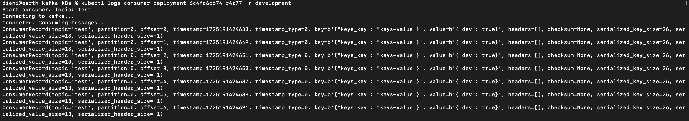

# kafka-k8s
Kafka producer and consumer deployed in Kubernetes.

## Prerequisites

1. Minikube: A local kubernetes cluster if you don't have another cluster available
2. Helm: To install Helm Charts on the kubernetes cluster
3. kubectl: Installed and configured to communicate with your cluster

## Kubernetes Deployment

### Start Minikube

Start your Minikube cluster with sufficient resources:

```bash
minikube start
```

### Deploy Kafka Server

First, add the Bitnami Helm repository

```bash
helm repo add bitnami https://charts.bitnami.com/bitnami
helm repo update
```

Create a namespace *development* that will contain the services

```bash
kubectl create namespace development
```

and deploy the charts version that you prefer into the development namespace

```bash
helm install kafka bitnami/kafka --version 26.4.3 -n development
```

the given chart version will use Kafka 3.6.0.

Now, give the pods for Kafka enough time to be up an running before continuing to deploy the consumer

```bash
kubectl get pods -n development
```


### Deploy Consumer

The following command will deploy the consumer image to the cluster.

```bash
make deploy-consumer
```

### Deploy Producer

The following command will deploy the producer image to the cluster.

```bash
make deploy-producer
```

## Verify

Check the logs of the consumer by first, retrieving the pods of the namespace

```bash
kubectl get pods -n development
```


The *CrashLoopBackOFF* is intended, as the pod of producer exited after sending the messages.

Now let's have a look on the logs of the consumer (copy the name of YOUR consumer pod)

```bash
kubectl logs consumer-deployment-6c4fc6cb74-r4z77 -n development
```



## Debug

It might be necessary to debug the application and therefore helpful, to publish and subscribe to the kafka broker. The kafka installation comes with clients we can use.

### Store Secrets

As we're using a SASL for authentication, we need to retrieve the user credentials of the user in the kafka broker and store it in a *client.properties* file.

```bash
$ cat > client.properties <<EOF
security.protocol=SASL_PLAINTEXT
sasl.mechanism=SCRAM-SHA-256
sasl.jaas.config=org.apache.kafka.common.security.scram.ScramLoginModule required \
    username="user1" \
    password="$(kubectl get secret kafka-user-passwords --namespace development -o jsonpath='{.data.client-passwords}' | base64 -d | cut -d , -f 1)";
EOF
```

### Run the Producer

Run another pod where the producer will run

```bash
kubectl run kafka-client --restart='Never' --image docker.io/bitnami/kafka:3.5.1-debian-11-r61 --namespace development --command -- sleep infinity
```

Copy the *client.properties* file to the client

```bash
kubectl cp --namespace development client.properties kafka-client:/tmp/client.properties
```

Run bash on the client

```bash
kubectl exec --tty -i kafka-client --namespace development -- bash
```

and start the producer

```bash
$ /opt/bitnami/kafka/bin/kafka-console-producer.sh \
            --producer.config /tmp/client.properties \
            --broker-list kafka-controller-0.kafka-controller-headless.development.svc.cluster.local:9092,kafka-controller-1.kafka-controller-headless.development.svc.cluster.local:9092,kafka-controller-2.kafka-controller-headless.development.svc.cluster.local:9092 \
            --topic test
```

Finally, let's send some messages...


### Run the consumer

To run the consumer, we open a new terminal window and bash again into the client, while keeping the window for the producer open

```bash
kubectl exec --tty -i kafka-client --namespace development -- bash
```

and start the consumer

```bash
$ /opt/bitnami/kafka/bin/kafka-console-consumer.sh \
            --consumer.config /tmp/client.properties \
            --bootstrap-server kafka.development.svc.cluster.local:9092 \
            --topic test \
            --from-beginning
```

We can see the messages produced by running a client in the pod of the *kafka-client* or by retrieving messages sent by the *kafka-producer* service.
